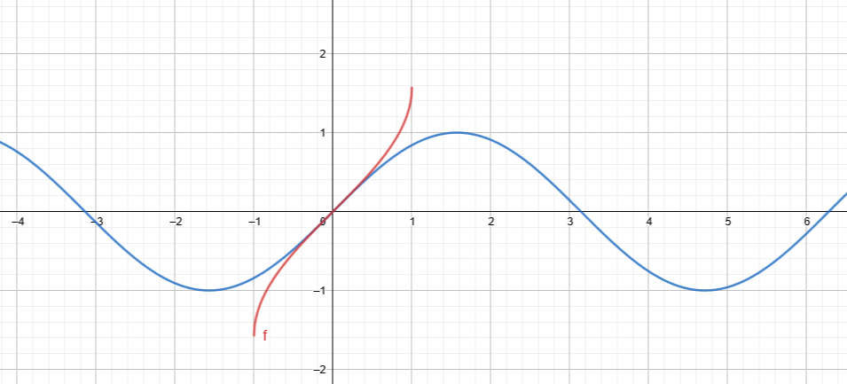
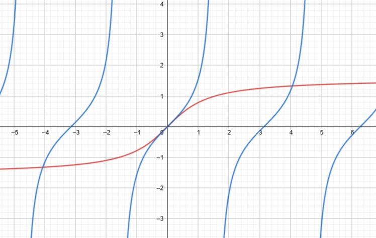

## Definiálja a $\pi$ számot.

$\exists! \xi \in [0,2] : \cos \xi = 0$, $\pi := 2 \xi$

## Értelmezze az $arc \sin$ függvényt, és ábrázolja egy koordináta-rendszerben a $\sin$ és $arc \sin$ függvényeket.

A $\sin$ függvény szig. mon. növekedő $[-\dfrac{\pi}{2}, \dfrac{\pi}{2}]$ intervallumon, ezért invertálható. Ennek a leszűkítésnek az inverze az $arc \sin$

## Értelmezze a $arc tg$ függvényt, és ábrázolja egy koordináta-rendszerben a $tg$ és az $arc tg$ függvényeket.

A $tg$ függvény szig. mon. nő a $(-\dfrac{\pi}{2}, \dfrac{\pi}{2})$ intervallumon, ezért invertálható. Ennek a leszűkítésének az inverze az $arc tg$ függvény.

 ## Mi a kétszer deriválható függvény fogalma?

Az $f \in \R \rarr \R$ függvény kétszer deriválható az $a \in int(D_f)$ pontban, ha
		$\exists K(a) \subset D_f$, hogy $f \in D[K(a)]$ és $f' \in D[a]$

## Mi a konvex függvény definíciója?

Az $f: (a,b) \rarr \R$ függvény konvex, ha 
$\forall x_1, x_2 \in (a,b), x_1 < x_2, \forall \lambda \in (0,1) :$
			$f(\lambda x_1 + (1-\lambda)x_2) \le \lambda f(x_1) + (1-\lambda)f(x_2)$

## Jellemezze egy függvény *konvexitását* az első derivált segítségével.

Legyen $I \subset \R$ tetsz. nyílt intervallum és $f : I \rarr \R$. Tfh.: $f \in D^2(I)$. 
Ekkor$f$ konvex (szig. konvex) $I$-n $\Leftrightarrow f' \nearrow (\uparrow)\ I$-n

## Jellemezze egy függvény *konkávitását* a második derivált segítségével.

Legyen $I \subset \R$ tetsz. nyílt intervallum és $f : I \rarr \R$. Tfh.: $f \in D^2(I)$. 
Ekkor: i, $f$ konkáv $I$-n $\Leftrightarrow f'' \le 0\ I$-n
			ii, Ha $f'' < 0\ I$-n $\Rarr f$ szig. konkáv $I$-n 
